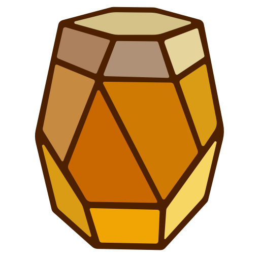

# CIDEr
Card IDE (CIDEr) - Design game cards using `HTML/Handlebars`, `CSS`, and `tabular` data.

[![][license]][license-url] 
[![][stars]][gh-url]
[![][release]][releases-url]
[![][downloads]][releases-url]
[![][last-commit]][gh-url]
[![][website]][pages-url]

Website: [Start using Cider][pages-url]

Download: [Windows, Mac, Ubuntu][releases-url]
  
Sample Game Project: [Cosmic Apple][cosmic-apple]

[#Template language reference][handlebars-url]

# About CIDEr
Cider was created to fill a niche between ease-of-use and versatility. The current market of board game/card creating applications seems to fit
into two categories: 1) advanced software with a steep learning curve and hundreds of pages of documentation, and 2) user-friendly graphical interface, but limited versatility. Cider is absolutely closer to the first category in execution since it currently provides no graphical template editor, but it makes up for the learning curve by using a templating language that many are already familiar with (HTML/Handlebars and CSS).

![screen-1]

# 1. Template
Create a template for each of the varying card fronts and card backs using
HTML/Handlebars and CSS. Use variables to reference attributes that
are unique to each card. Use control logic to conditionally display
specific parts of the template.

[#Template language reference][handlebars-url]

![screen-2]

# 2. Tabulate
Create attributes relevant to your game and fill out their values for each
card. Choose the front and back templates for each card.

![screen-3]

# 3. Preview
Preview the way the cards look with the tabular data applied to the templates.

![screen-4]

# 4. Export
Export the cards as individual images (PNG), or as card sheets ready to print (PDF). Adjust the paper size, paper margins, and spacing between cards. You can also export in `low ink mode` for quick prototyping.

![screen-5]

Export card sheets for use directly in Tabletop Simulator.
[#Tabletop Simulator export guide][ttsexport-url]

# 5. Save
There are various ways you can save your project files depending on the form of the application you are using.

## 5.1 Web Application
In the web application your project remains in IndexedDB within the browser storage. You can export the database as a single `database.json` file. This file can be stored somewhere safe and also transfered and imported to other devices.

## 5.2 Desktop Application
In the desktop application, the primary project structure is a directory that holds an exploded form of the project as `.csv`, `.html`, `.css`, and `image` files. These files can be edited in other applications for batch tasks or to align with an existing user workflow. You may also export or import the project as a single `database.json` file.

![image-file-tree]

# Creative Ownership
Anything you create using CIDEr is your own intellectual property.
The website hosts nothing and all of your card data and assets sit
in IndexedDB on your browser. You may export and import your entire
database to a .json file to use between devices. You may host your own
version of the CIDEr website by downloading the source code and running `npm install && ng serve`.

The repository itself is protected by [AGPL-3.0][license-url] to ensure the project remains open-sourced.

[last-commit]: https://img.shields.io/github/last-commit/oatear/cider
[license]: https://badgen.net/github/license/oatear/cider?cache=600
[stars]: https://img.shields.io/github/stars/oatear/cider
[release]: https://img.shields.io/github/v/release/oatear/cider
[downloads]: https://img.shields.io/github/downloads/oatear/cider/total
[website]: https://img.shields.io/website?down_color=red&down_message=offline&up_color=green&up_message=online&url=https%3A%2F%2Foatear.github.io%2Fcider
[logo-url]: docs/assets/cider-logo-80.png
[screen-1]: cider-app/src/assets/screen-1.png
[screen-2]: cider-app/src/assets/screen-2.png
[screen-3]: cider-app/src/assets/screen-3.png
[screen-4]: cider-app/src/assets/screen-4.png
[screen-5]: cider-app/src/assets/screen-5.png
[image-file-tree]: cider-app/src/assets/image-file-tree.png
[gh-url]: https://github.com/oatear/cider
[releases-url]: https://github.com/oatear/cider/releases
[cosmic-apple]: https://github.com/oatear/cosmic-apple-game
[handlebars-url]: HANDLEBARS.md
[ttsexport-url]: TTS_EXPORT.md
[license-url]: LICENSE.md
[pages-url]: https://oatear.github.io/cider
